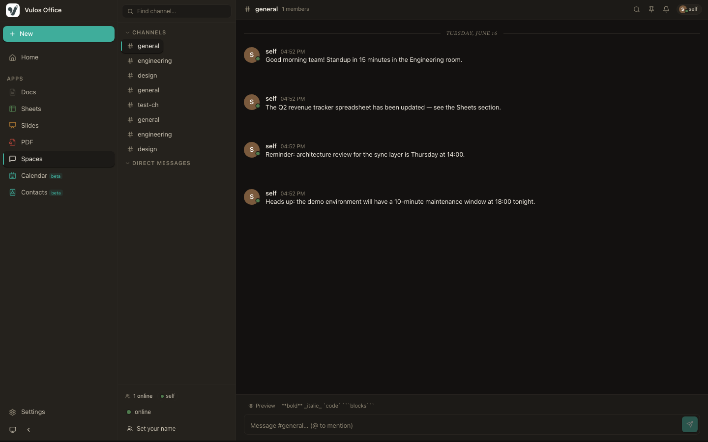
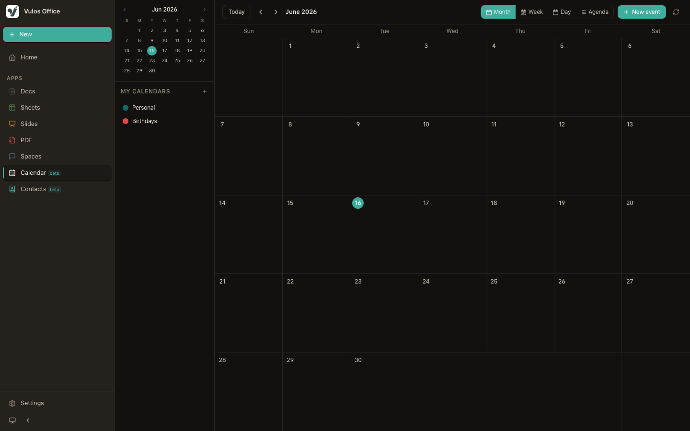
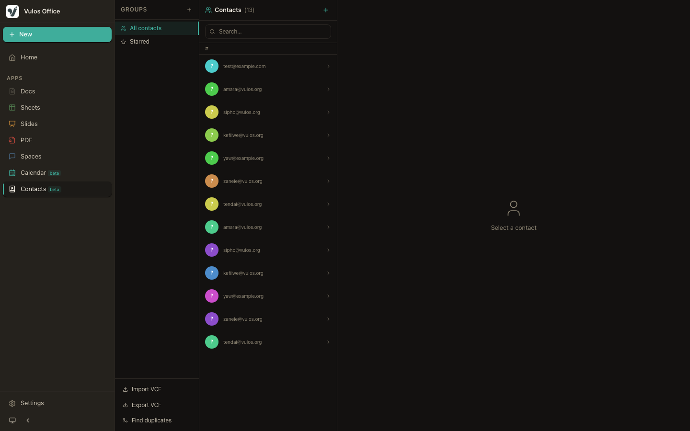
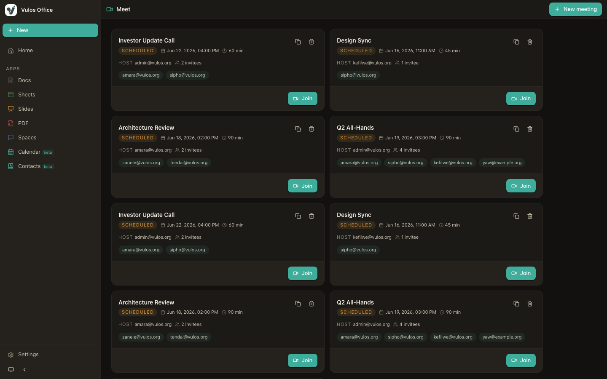

<div align="center">


# Vulos Office

**Documents · Sheets · Slides · PDF · Spaces · Calendar · Contacts · Meetings**

[](LICENSE)
[](CHANGELOG.md)
[](https://github.com/vul-os/vulos-office/actions)
[](https://golang.org)
[](https://react.dev)
[](https://github.com/vul-os/vulos-office/pulls)

*Vulos — rooted in **vula**, the Zulu and Xhosa word for **open**.*

<sub>Part of the <strong><a href="https://vulos.org">Vulos</a></strong> OS suite &nbsp;</sub>


</div>

---

## Overview

Vulos Office is a self-hosted, open-source office suite that ships as a **single Go binary**. It brings document editing, spreadsheets, presentations, PDF annotation and signing, team chat (Spaces), calendar, and contacts together in a clean, modern interface — no cloud account required, no telemetry, no lock-in.

It stands as a tribute to the spirit of **LibreOffice** and **OpenOffice** — the pioneers who proved that powerful productivity software could be free, open, and community-driven. Vulos carries that torch into the browser, with a lightweight Go backend and a fast React frontend, deployable anywhere in seconds.

> *"Vula" — open the door. Vulos Office is that door.*

Vulos Office is also published as an npm library (`@vulos/office-client`) so the Vulos OS shell can embed any surface as a native app panel:

```js
import { DocsEditor }   from '@vulos/office-client/docs'
import { SheetsEditor } from '@vulos/office-client/sheets'
import { SlidesEditor } from '@vulos/office-client/slides'
import { PDFEditor }    from '@vulos/office-client/pdf'
import { SpacesApp }    from '@vulos/office-client/spaces'
import { CalendarApp }  from '@vulos/office-client/calendar'
import { ContactsApp }  from '@vulos/office-client/contacts'
```

> **Codebase rule:** this repo uses `.jsx` only — never `.tsx`.

---

## Screenshots

See [`docs/SCREENSHOTS.md`](docs/SCREENSHOTS.md) for the full gallery and instructions to regenerate.

| Home | Docs Editor |
|------|-------------|
|  |  |

| Sheets Editor | Slides Editor |
|---------------|---------------|
|  |  |

| Spaces | Calendar |
|--------|----------|
|  |  |

| Contacts | Meetings |
|----------|---------|
|  |  |

---

## Features

| Surface | Description |
|---------|-------------|
| **Documents** | Rich text editing via TipTap — headings, tables, lists, task lists, links, images, track-changes, comments |
| **Spreadsheets** | Full-featured grid via Fortune Sheet — formulas, formatting, multi-sheet, charts, pivot tables, import/export |
| **Presentations** | Slide editor powered by Reveal.js — create, theme, transition, and present from the browser |
| **PDF** | View, annotate, sign; multi-party signing envelopes with cryptographic audit trail |
| **Vulos Spaces** | Team channels, DMs, threads, reactions, pins, search, presence, voice/video meetings |
| **Calendar** | Events, recurrence (iCalendar/rrule), reminders, `.ics` import/export |
| **Contacts** | Contact management, vCard import/export, duplicate detection |
| **Export** | `.docx`, `.xlsx`, `.pptx`, `.pdf`, Markdown |
| **Import** | DOCX, XLSX, CSV, PPTX, URL, local file |
| **Auth** | Optional password-based auth with JWT — off by default for local use |
| **Storage** | Local JSON files (default); PostgreSQL (multi-user); S3-compatible (Tigris/MinIO) |
| **Single binary** | Go embeds the entire frontend — one file to deploy |
| **PWA-ready** | Installable as a desktop/mobile app via web manifest |
| **Observability** | Prometheus metrics + OpenTelemetry traces |

---

## Quick start

### Prerequisites

- [Go 1.21+](https://golang.org/dl/)
- [Node.js 18+](https://nodejs.org/) and npm

### Development

```bash
# Clone the repo
git clone https://github.com/vul-os/vulos-office.git
cd vulos-office

# Install dependencies
npm install
go mod tidy

# Start dev server (Vite on :5173, Go API on :8080)
npm run dev:web
```

Open [http://localhost:5173](http://localhost:5173).

### Production build

```bash
# Build frontend + Go binary in one step
npm run build

# Run the single binary
./vulos-office
```

Open [http://localhost:8080](http://localhost:8080). The entire app is embedded in the binary.

### Docker

```sh
docker run -d \
  --name vulos-office \
  -p 8080:8080 \
  -v office-data:/data \
  ghcr.io/vul-os/vulos-office:latest
```

---

## Documentation

| Document | Description |
|----------|-------------|
| [docs/GETTING-STARTED.md](docs/GETTING-STARTED.md) | Full setup walkthrough |
| [docs/ARCHITECTURE.md](docs/ARCHITECTURE.md) | Component map and key design decisions |
| [docs/CONFIGURATION.md](docs/CONFIGURATION.md) | All env vars, config.yaml reference, OTEL/SMTP |
| [docs/SCREENSHOTS.md](docs/SCREENSHOTS.md) | Screenshot gallery + how to regenerate |
| [docs/DEPLOY.md](docs/DEPLOY.md) | Self-hosting, Docker, single-box co-location |
| [docs/INSTALL.md](docs/INSTALL.md) | Single-box install with Vulos OS |
| [docs/RELEASING.md](docs/RELEASING.md) | Release policy and CI pipeline |
| [ROADMAP.md](ROADMAP.md) | Planned features and milestones |
| [CHANGELOG.md](CHANGELOG.md) | Version history |
| [TASKS.md](TASKS.md) | Implementation task tracker |
| [DEPLOY.md](DEPLOY.md) | Static CDN deploy (Tigris) |

---

## Development

### Build and test

```bash
# Frontend dev server (Vite :5173) + Go API (:8080)
npm run dev:web

# Run all frontend tests
npm test

# Build monolithic dist/ + Go binary
npm run build

# Build all sub-targets (office / talk / calendar / meet) + library
npm run build:all

# Build library only (dist-lib/ for @vulos/office-client consumers)
npm run build:lib
```

### Regenerate screenshots

```bash
npm run screenshots
```

Builds and starts a temporary Go server seeded with demo data (Spaces channels, calendar events, contacts, meetings, and sample docs/sheets/slides), captures all app surfaces at 1440×900, then stops the server. No separate dev server required. See [`docs/SCREENSHOTS.md`](docs/SCREENSHOTS.md) for details.

---

## Contributing

Pull requests are welcome. For major changes, please open an issue first to discuss what you'd like to change.

1. Fork the repo
2. Create your branch (`git checkout -b feat/my-feature`)
3. Commit your changes (`git commit -m 'feat: add my feature'`)
4. Push to the branch (`git push origin feat/my-feature`)
5. Open a Pull Request

See [CONTRIBUTING.md](CONTRIBUTING.md) for the full guide, code style, and security disclosure policy.

---

## License

[MIT](LICENSE) — free to use, modify, and distribute.

---

<div align="center">

Made with care · Powered by open source · *Vula — open*

</div>
