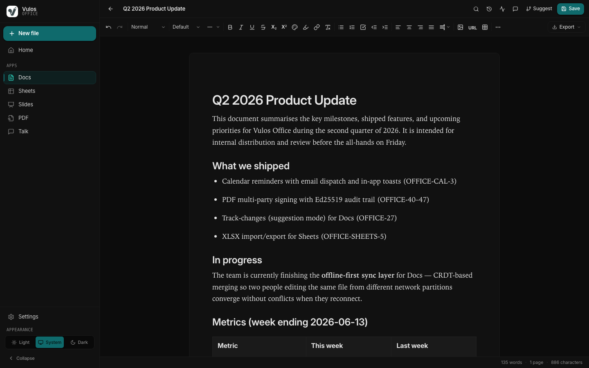
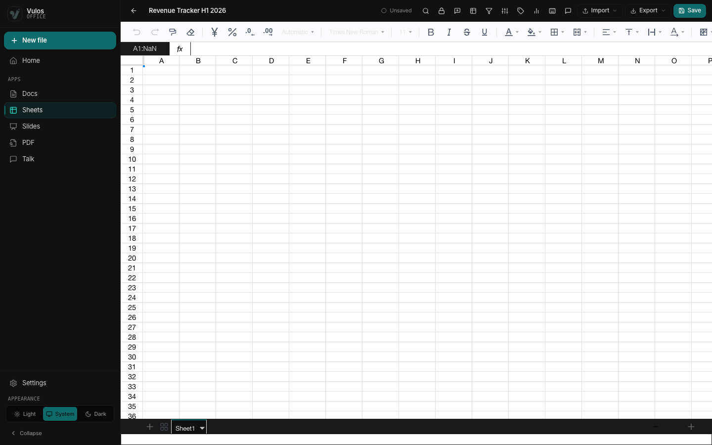
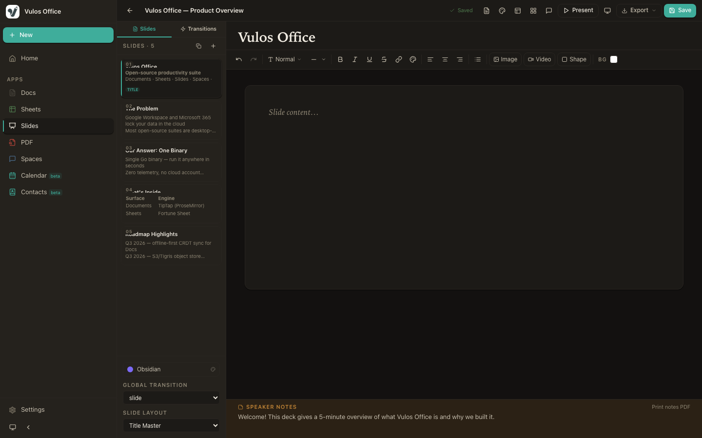
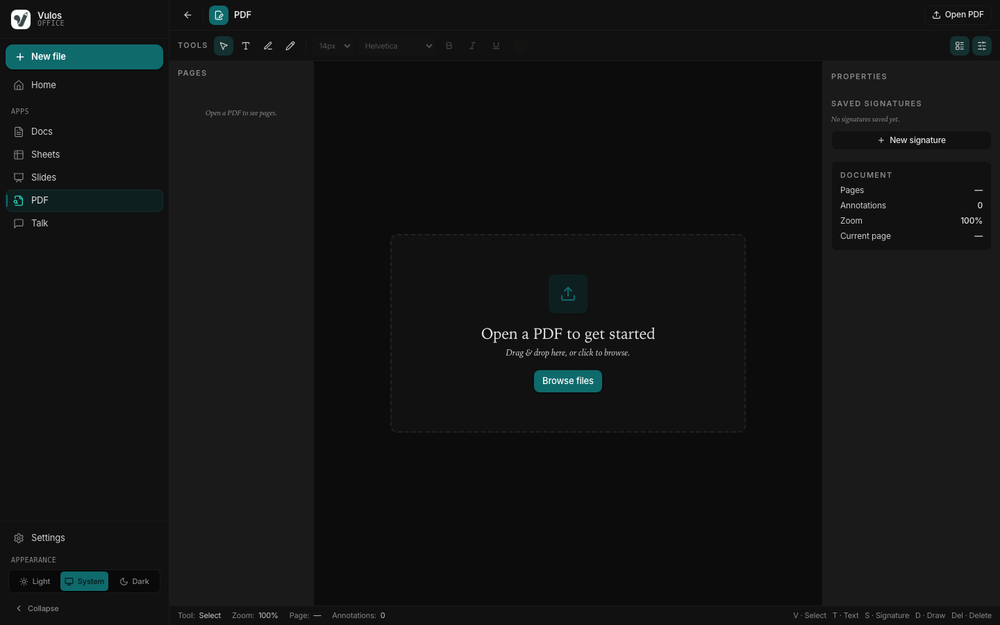
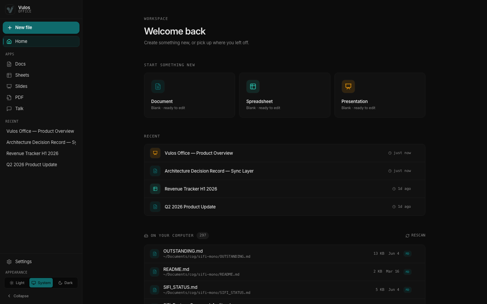
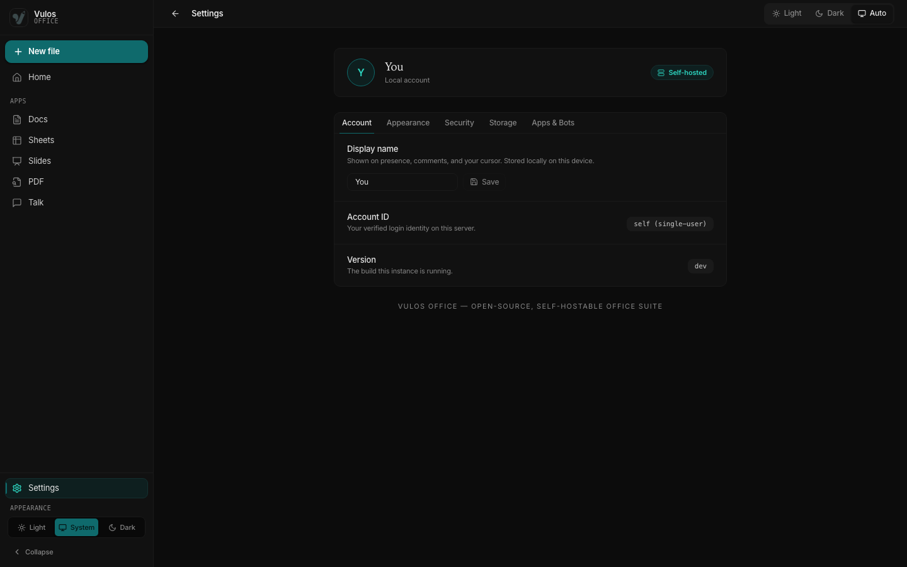
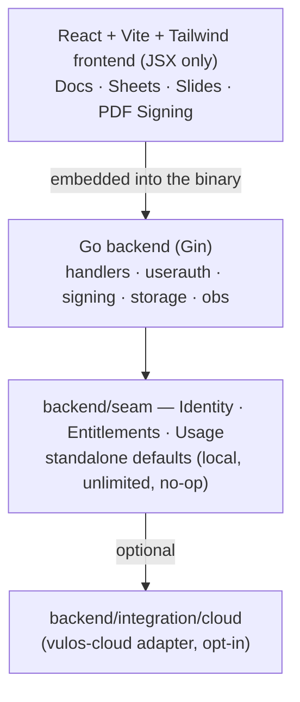

<div align="center">


# Vulos Office

**A sovereign, self-hostable office suite — your documents, your server, your rules.**

Docs · Sheets · Slides · PDF Signing

[](LICENSE)
[](CHANGELOG.md)
[](https://golang.org)
[](https://react.dev)
[](CONTRIBUTING.md)

<sub> Part of <strong><a href="https://vulos.org">VulOS</a></strong> — the open, self-hostable web OS &amp; app suite. Runs standalone, or combined under one login by <a href="https://vulos.org">Vulos Workspace</a>.</sub>

</div>

<p align="center">
  
</p>

---

## What is this?

Vulos Office is the **documents** product of VulOS, shipped as a **single Go binary** with the entire frontend embedded — no cloud account, no telemetry, no lock-in. It brings document editing, spreadsheets, presentations, and cryptographic document signing together in one clean, modern web interface. (Calendar and Contacts now live in the **Vulos Mail/PIM** product — see [Part of VulOS](#part-of-vulos).)

It is **independently self-hostable by default**: with zero configuration it runs as a single-user, local-storage app on your own machine. Everything that *could* tie it to an external service lives behind a small, clean **seam** — so you can run it fully standalone, or opt into the [vulos-cloud](#self-hosting) control plane for multi-tenant identity, entitlements, and usage. The core never imports cloud code; remove the adapter and the standalone build still compiles.

It stands as a tribute to **LibreOffice** and **OpenOffice** — the pioneers who proved productivity software could be free, open, and community-driven — and carries that torch into the browser with a fast React frontend and a lightweight Go backend.

> *"Vula" — open the door. Vulos Office is that door.*

---

## Part of VulOS

**VulOS** is an open, self-hostable web OS + app suite. Each product is independently self-hostable on its own, and they combine under one login via **Vulos Workspace**:

- **Vulos Mail** — mail + calendar + contacts (engine: lilmail; server: vulos-mail)
- **Vulos Talk** — team chat + channels/Spaces + huddles
- **Vulos Meet** — video meetings (LiveKit SFU)
- **Vulos Office** — documents: docs, sheets, slides, PDF *(this repo)*
- **Vulos Relay** — sovereign connectivity fabric (`@vulos/relay-client`)
- **Vulos Workspace** — the open suite shell (one login, app switcher, admin)
- **Vulos OS** — the web-native desktop

Products never import each other — Vulos Workspace *links/embeds* them across clean seams.

**Vulos Office's role:** the documents surface — Docs, Sheets, Slides, and PDF/Signing. It **runs standalone** as a single Go binary **and** is combined under one login by Vulos Workspace. Its sidebar links out to Vulos Talk and Vulos Meet, but never embeds them — chat lives in **vulos-talk** and video in **vulos-meet**. Calendar and Contacts are **not** part of Office; they are the canonical PIM surfaces of **Vulos Mail** (CalDAV/CardDAV + lilmail `/v1/calendar` + `/v1/contacts`).

---

## Features

| Surface | Description |
|---------|-------------|
| **Docs** | Rich-text editing via TipTap — headings, tables, task lists, links, images, comments |
| **Sheets** | Full spreadsheet grid via Fortune Sheet — formulas, formatting, multi-sheet, charts, pivots |
| **Slides** | Presentation editor powered by Reveal.js — theme, transition, and present from the browser |
| **Signing** | View, annotate, and sign PDFs; multi-party signing envelopes with a cryptographic audit trail |
| **Import / Export** | `.docx`, `.xlsx`, `.csv`, `.pptx`, `.pdf`, Markdown, and from URL |
| **Storage** | Local files + SQLite by default; optional PostgreSQL for multi-user |
| **Auth** | Optional password / JWT login — off by default for local use |
| **Single binary** | The Go server embeds the whole frontend — one file to deploy |
| **PWA-ready** | Installable as a desktop / mobile app via web manifest |
| **Observability** | Prometheus metrics at `/metrics` and optional OpenTelemetry traces |

Every surface is also published as an npm library (`@vulos/office-client`) so Vulos Workspace — or your own app — can embed any editor as a native panel:

```js
import { DocsApp }     from '@vulos/office-client/docs'
import { SheetsApp }   from '@vulos/office-client/sheets'
import { SlidesApp }   from '@vulos/office-client/slides'
import { PDFApp }      from '@vulos/office-client/pdf'
```

---

## Screenshots

|  |  |
| :---: | :---: |
| **Docs** — rich text, tables, comments | **Sheets** — formulas, charts, pivots |
|  |  |
| **Slides** — themes, transitions, present | **Signing** — annotate & sign PDFs |
|  |  |
| **Home** — workspace & recent files | **Settings** — account, storage & admin |
|  |  |

> Regenerate anytime with `npm run screenshots` — it boots the app with seeded demo data (no real backend or credentials needed) and captures every screen. See [docs/SCREENSHOTS.md](docs/SCREENSHOTS.md).

---

## Quick start (standalone)

Vulos Office runs **by itself** — no account, no cloud, no other Vulos product required.

### Docker (one-liner)

```bash
docker run -d \
  --name vulos-office \
  -p 8080:8080 \
  -v office-data:/data \
  ghcr.io/vul-os/vulos-office:latest
```

Open <http://localhost:8080>.

### From source (single binary)

Prerequisites: [Go 1.25+](https://golang.org/dl/) and [Node.js 18+](https://nodejs.org/) with npm.

```bash
git clone https://github.com/vul-os/vulos-office.git
cd vulos-office

# Install deps and build the frontend + single binary
npm install
npm run build

# Run — single-user, local storage, no auth, no cloud
./vulos-office
```

Open <http://localhost:8080>. Data lives in `./data` and `./uploads`. That's the whole app, in one file.

### Develop

```bash
# Vite dev server (:5173) + Go API (:8080), live reload
npm run dev:web
```

Open <http://localhost:5173>.

### Minimal config

No configuration is required to run standalone. To require login (still fully standalone — no control plane):

```bash
# config.yaml → auth.enabled: true
export VULOS_OFFICE_JWT_SECRET="$(openssl rand -hex 32)"
./vulos-office
```

---

## Architecture



The boundary between Office's core and any external control plane is a small set of Go interfaces in `backend/seam`. The composition root (`main.go`) wires the standalone defaults via `seam.NewStandaloneProvider(...)`:

| Interface | Standalone default |
|-----------|--------------------|
| `seam.Identity` | `LocalIdentity` — verifies Office's own HS256 session JWT |
| `seam.Entitlements` | `LocalEntitlements` — unlimited, `self-hosted` tier, all features |
| `seam.Usage` | `NoopUsage` — discards metering (Prometheus still exported) |

The cloud adapter lives in a **separate package** and is selected *only* when `VULOS_CP_BASE_URL` is set. With it unset (the default), none of it runs. See [SELFHOST.md](SELFHOST.md) for the full seam contract.

---

## Configuration

Config is read from `config.yaml` (see the checked-in [`config.yaml`](config.yaml)) and selected environment variables. Sensible defaults mean **no configuration is required** to run standalone.

### `config.yaml`

```yaml
server:
  addr: ":8080"
  data_dir: "./data"
  uploads_dir: "./uploads"
auth:
  enabled: false          # set true to require login
  password: "changeme"
  session_hours: 24
storage:
  type: "local"           # "local" or "postgres"
```

### Environment variables

| Variable | Purpose |
|----------|---------|
| `VULOS_OFFICE_JWT_SECRET` | HS256 secret for session JWTs — **required when auth is enabled** |
| `VULOS_OFFICE_DEV` | `1` uses a labelled insecure dev secret — local development only |
| `VULOS_OFFICE_CORS_ORIGINS` | Comma-separated allowed CORS origins |
| `VULOS_USERAUTH_DB` | Override the credential SQLite store path |
| `OTEL_EXPORTER_OTLP_ENDPOINT` | Enable OpenTelemetry trace export |
| `VULOS_CP_BASE_URL` | **Opt-in** vulos-cloud control plane URL (enables the cloud seam) |
| `VULOS_CP_TOKEN` | Outbound service token for the control plane |
| `VULOS_ORG_ID` | Tenant / org scoping (used by the cloud adapter and storage) |

See [docs/CONFIGURATION.md](docs/CONFIGURATION.md) for the complete reference.

---

## Self-hosting

Vulos Office is **built to be self-hosted by you**, not rented from anyone. The standalone path is the default and requires no cloud, no account, and no external service:

- **Identity** is local — every request is the `self` account in single-user mode; flip on multi-user auth with a JWT secret.
- **Entitlements** are unlimited (`tier: self-hosted`) — no metering, no quotas, all features on.
- **Storage** is local files + SQLite under `./data` and `./uploads`.

Full standalone instructions, the seam contract, and the optional cloud integration are in **[SELFHOST.md](SELFHOST.md)**. Deployment notes (Docker, single-box co-location) live in [docs/DEPLOY.md](docs/DEPLOY.md) and [DEPLOY.md](DEPLOY.md).

### Optional: the vulos-cloud seam

Setting `VULOS_CP_BASE_URL` selects the `backend/integration/cloud` adapter, which implements the same `seam` interfaces against the [vulos-cloud](https://vulos.org) control plane for multi-tenant identity, entitlements, and usage. Entitlement fetches **fail open** on a transient outage. Leave it unset and Office is 100% standalone.

---

## Documentation

| Document | Description |
|----------|-------------|
| [SELFHOST.md](SELFHOST.md) | Run fully standalone; the optional cloud seam |
| [docs/GETTING-STARTED.md](docs/GETTING-STARTED.md) | Full setup walkthrough |
| [docs/ARCHITECTURE.md](docs/ARCHITECTURE.md) | Component map and design decisions |
| [docs/CONFIGURATION.md](docs/CONFIGURATION.md) | Env vars, `config.yaml`, OTEL / SMTP reference |
| [docs/DEPLOY.md](docs/DEPLOY.md) | Self-hosting, Docker, single-box co-location |
| [docs/SCREENSHOTS.md](docs/SCREENSHOTS.md) | Regenerating the screenshot gallery |
| [ROADMAP.md](ROADMAP.md) · [CHANGELOG.md](CHANGELOG.md) | Plans and version history |

---

## Development

```bash
npm run dev:web        # Vite (:5173) + Go API (:8080)
npm test               # frontend tests (Vitest)
npm run build          # frontend dist/ + Go binary
npm run build:all      # all sub-targets (office) + library
npm run build:lib      # @vulos/office-client library only
npm run screenshots    # regenerate the docs/screenshots gallery (seeded demo data)

# Backend
go build ./...
go test ./...
go vet ./...
```

> **Frozen invariants:** pure Go (no CGO), JSX only (never `.tsx`), no Google SSO, no Stripe. See [CONTRIBUTING.md](CONTRIBUTING.md).

---

## Security

Found a vulnerability? Please report it responsibly — see **[SECURITY.md](SECURITY.md)** for scope, the disclosure process, and our response SLA. Do not open public issues for security reports.

---

## Contributing

Pull requests are welcome — bug fixes, signing robustness, accessibility, tests, and docs especially. For major changes, open an issue first. See **[CONTRIBUTING.md](CONTRIBUTING.md)** for setup, code style, and the frozen invariants. No CLA required.

---

## License

[MIT](LICENSE) — free to use, modify, and distribute.

---

<div align="center">

Made with care · Powered by open source · *Vula — open*

</div>
