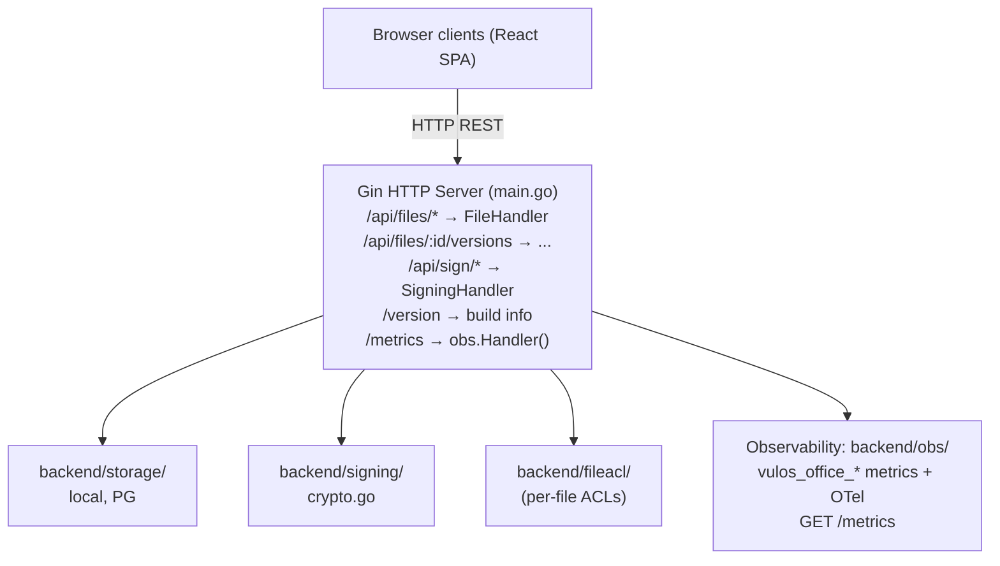

# Vulos Office – Architecture

## Overview

Vulos Office is a collaborative document editing + e-signing service. It exposes:
- File CRUD with version history
- REST-based persistence and collaboration (comments, suggestions)
- E-signing workflow (envelope → sign → sealed PDF)

> **Scope:** Office is documents-only (Docs, Sheets, Slides, PDF/Signing). Calendar
> and Contacts moved to the **Vulos Mail/PIM** product (vulos-mail CalDAV/CardDAV +
> lilmail `/v1/calendar` + `/v1/contacts`). Video (Meet) lives in `vulos-meet` and
> chat/spaces (Talk) lives in `vulos-talk`. Vulos Workspace is the suite shell that
> combines the products.

> **Collaboration transport note:** Real-time co-editing is currently REST + persistence
> based (edits round-trip through the backend). The client-side CRDT modules in
> `src/lib/crdt/` are live and used for local merge/ordering, but live P2P document
> sync over the Vulos peer fabric is a planned future milestone — not yet wired.

## Component Map

## Key Design Decisions

- **Gin framework**: chosen for its middleware ecosystem and existing codebase.
- **Client-side CRDT modules** (`src/lib/crdt/`): text, grid, tree, comment, and
  suggestion CRDTs run in the browser for local ordering and offline-tolerant merge.
  Live P2P document sync over the fabric is a planned future milestone.
- **E-signing**: PDF is sealed with a cryptographic hash; audit manifest JSON captures all signer events.
- **Auth**: JWT-based; configurable (`cfg.Auth.Enabled`). Per-user credentials stored in
  pure-Go SQLite (`backend/userauth/`).
- **Storage**: pluggable interface — local JSON (default), PostgreSQL (multi-user), or
  S3-compatible object store (BYO/Tigris).
- **Org-bucket wiring**: `backend/storage/backendconfig.go` carries `OfficeBackendConfig`
  for per-org S3 bucket + CRDT snapshot configuration, injected by the Vulos control plane.
- **Per-file ACLs**: `backend/fileacl/` enforces per-file read/write/admin permissions
  backed by SQLite or Postgres (co-located with the file store).

## See Also

- Deployment: `docs/DEPLOY.md`
- Install (single-box with Vulos OS): `docs/INSTALL.md`
- Versioning & release: `docs/RELEASING.md`
- Security model: `SECURITY.md`, `THREAT-MODEL.md`
