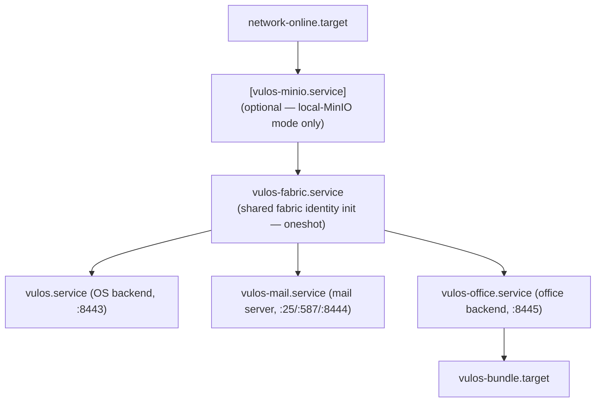

# Vulos Office — Install Guide

This document covers how to install and run `vulos-office` either co-located
with Vulos OS + vulos-mail (the recommended single-box deployment) or as a
standalone service.

For an end-to-end deployment walkthrough (Docker, building from source,
upgrading), see [`DEPLOY.md`](DEPLOY.md).

---

## Co-located deployment (recommended)

The supported "easy path" is the **co-located bundle**: one box runs Vulos OS,
vulos-mail, and vulos-office, all sharing **one S3-compatible bucket endpoint**
(Vulos-managed Tigris by default; local MinIO via the OS-side storage selector
opt-in). All three services share one CRDT/peering fabric and one identity.

### Use the bundle installer (canonical command)

The `vulos` repo provides a meta-bundle installer (`BUNDLE-01`,
[`scripts/install-vulos.sh`](https://github.com/vul-os/vulos/blob/main/scripts/install-vulos.sh))
that provisions OS + mail + office, writes their systemd units, and seeds the
shared storage config. Do **not** duplicate it here — invoke it:

```sh
# Tigris-backed (default)
curl -fsSL https://get.vulos.org | sudo bash

# Local-MinIO-backed (BYO single-box)
curl -fsSL https://get.vulos.org | sudo bash -s -- --storage=minio
```

After install:

```sh
sudo systemctl enable --now vulos-bundle.target
```

See https://docs.vulos.org/self-host/bundle for the full bundle reference.

### Shared storage config (env)

The OS-side storage-mode selector (`STORE-LOCAL-01`,
`vulos/backend/internal/storagemode/`) writes a single shared env file
(consumed by `vulos.service`, `vulos-mail.service`, and `vulos-office.service`)
with the following variables. Office reads these at startup and passes them
into [`OfficeBackendConfig`](../backend/storage/backendconfig.go):

| Variable                | Purpose                                                                 |
|-------------------------|-------------------------------------------------------------------------|
| `VULOS_STORAGE_MODE`    | `central-tigris` (default) or `local-minio-sync` (BYO single-box MinIO) |
| `VULOS_MINIO_ENDPOINT`  | S3 endpoint URL (only when mode is `local-minio-sync`)                  |
| `VULOS_MINIO_REGION`    | Region label (defaults to `auto`)                                       |
| `VULOS_MINIO_BUCKET`    | Bucket shared by OS + mail + office (e.g. `vulos-bundle`)               |
| `VULOS_MINIO_CREDS_REF` | Path to the credentials file (e.g. `/var/lib/vulos/minio/.minio_secret`) |

In `central-tigris` mode, office falls back to the canonical Tigris env vars
(`TIGRIS_ENDPOINT`, `TIGRIS_REGION`, `TIGRIS_ACCESS_KEY_ID`,
`TIGRIS_SECRET_ACCESS_KEY`) via `OfficeTigrisDefaults()`.

### Systemd unit ordering

The bundle installer writes the units below — `vulos-office` starts **after**
`vulos-mail`, and both start after the shared `vulos-fabric.service` oneshot
(which performs the shared identity/fabric init). All three are pulled in by
`vulos-bundle.target` (the all-up sentinel).



The relevant ordering for office (from
[`scripts/vulos-office.service`](https://github.com/vul-os/vulos/blob/main/scripts/vulos-office.service)
in the `vulos` repo):

```ini
[Unit]
After=network-online.target vulos-fabric.service vulos.service
Requires=vulos-fabric.service

[Install]
WantedBy=multi-user.target vulos-bundle.target
```

Office is intentionally ordered **after** `vulos.service` and the fabric
oneshot so the shared bucket creds + fabric identity are already in place
before office tries to open the storage backend. The bundle target
([`scripts/vulos-bundle.target`](https://github.com/vul-os/vulos/blob/main/scripts/vulos-bundle.target))
`Wants=` and `After=` all three services so `systemctl start vulos-bundle.target`
brings the suite up atomically (and `systemctl stop` tears it down).

---

## Standalone office

If you only want the office suite (no Vulos OS, no vulos-mail), run office
directly and inject the storage endpoint yourself via
[`OfficeBackendConfig`](../backend/storage/backendconfig.go) — there is no
endpoint-selection logic inside vulos-office; it just receives what you give
it. See `OFFICE-STORE-01` in [`TASKS.md`](../TASKS.md).

The two accepted shapes:

### Tigris (managed default)

```go
cfg := storage.OfficeTigrisDefaults()
cfg.Bucket = "my-office-bucket"
cfg.Prefix = "acct-1234"
client, err := storage.NewOfficeS3Client(cfg)
```

Reads `TIGRIS_ENDPOINT`, `TIGRIS_REGION`, `TIGRIS_ACCESS_KEY_ID`,
`TIGRIS_SECRET_ACCESS_KEY` from env (defaults to
`https://fly.storage.tigris.dev` / region `auto`).

### MinIO (BYO self-host)

```go
cfg := storage.OfficeBackendConfig{
    Kind:            storage.OfficeBEKindMinIO,
    Endpoint:        "https://minio.example.lan",   // must be https://
    Region:          "auto",
    Bucket:          "vulos-office",                 // required
    Prefix:          "acct-1234",
    AccessKeyID:     "…",
    SecretAccessKey: "…",
}
client, err := storage.NewOfficeS3Client(cfg)
```

Both backends use the same S3-compatible interface (pure-Go SigV4, no CGO).
Office logs the resolved endpoint at startup.

For the runtime config file and Docker quick-start, see
[`DEPLOY.md`](DEPLOY.md).
